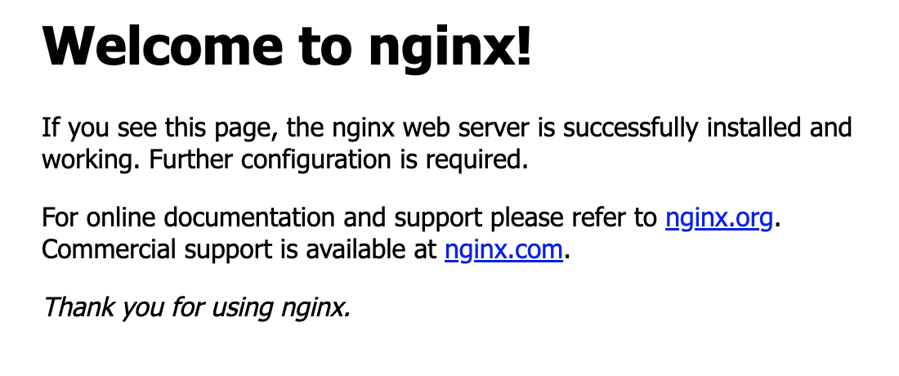

## 1.docker架构


### registry 镜像仓库

registry可以理解为镜像仓库，用于保存docker image。
Docker Hub 是docker官方的镜像仓库，docker命令默认从docker hub中拉取镜像。我们也可以搭建自己的镜像仓库。

### image 镜像

image可以理解为一个只读的应用模板。image包含了应用程序及其所需要的依赖环境，例如可执行文件、环境变量、初始化脚本、启动命令等。

### container 容器

容器是image的一个运行实例。当我们运行一个image，就创建了一个容器。

## 2.docker pull 拉取镜像

从镜像仓库拉取镜像到本地
`docker pull nginx` 不写默认是latest
`docker pull nginx:latest`
`docker pull nginx:1.22`
`docker pull nginx:1.22.0-alpine`
一般不建议使用latest，因为最新的镜像是滚动更新的，过一段时间，可能跟你本地的不是同一个。
使用`docker images`命令查看本地镜像

## 3.docker run 命令

`docker run [可选参数] 镜像名:版本 []`

### 公开端口(-p)

`docker run --name some-nginx -d -p 8080:80 nginx:1.22`
默认情况下，容器无法通过外部网络访问。
需要使用`-p`参数将容器的端口映射到宿主机端口，才可以通过宿主机IP进行访问。
浏览器打开 http://192.168.56.106:8080

`-p 8080-8090:8080-8090`公开端口范围，前后必须对应
`-p 192.168.56.106:8080:80`如果宿主机有多个ip，可以指定绑定到哪个ip

### 后台运行

`docker run --name db-mysql -e MYSQL_ROOT_PASSWORD=123456 -d mysql:5.7`
使用run命令，部署mysql，docker先去本地查找镜像，如果找不到，就去docker hub中拉取镜像

- `--name` 定义容器的名称
- `-e` 声明环境变量
- `-d`容器在后台运行
- 查看容器ip

```bash
docker inspect \
	--format='{{range .NetworkSettings.Networks}}{{.IPAddress}}{{end}}' db-mysql
```

可以使用以下命令操作容器：
`docker start db-mysql` 启动容器
`docker stop`   关闭容器
`docker restart` 重启容器
`docker rm` 删除容器

### 前台交互运行

创建一个新的容器，使用mysql客户端
`docker run -it --rm mysql:5.7 mysql -h172.17.0.2 -uroot -p`
`-it` 使用交互模式，可以在控制台里输入、输出
`--rm`**在容器退出时自动删除容器。**一般在使用客户端程序时使用此参数。
如果每次使用客户端都创建一个新的容器，这样将占用大量的系统空间。
`mysql -h172.17.0.2 -uroot -p`表示启动容器时执行的命令。

- `docker exec`在运行的容器中执行命令，一般配合`-it`参数使用交互模式

```bash
docker exec -it db-mysql /bin/bash
```

## 3.常用命令

- `docker ps` 查看正在运行的容器
- `docker ps -a` 查看所有容器，包括正在运行和停止的
- `docker inspect` 查看容器的信息
- `docker logs`查看日志
- `docker cp` 在容器和宿主机间复制文件

```bash
docker cp ./some_file 容器名:/work
docker cp 容器名:/var/logs/ /tmp/app_logs
```

参考文档：
[https://docs.docker.com/get-started/overview/](https://docs.docker.com/get-started/overview/)<br/>
[https://docs.docker.com/engine/reference/run/](https://docs.docker.com/engine/reference/run/)

