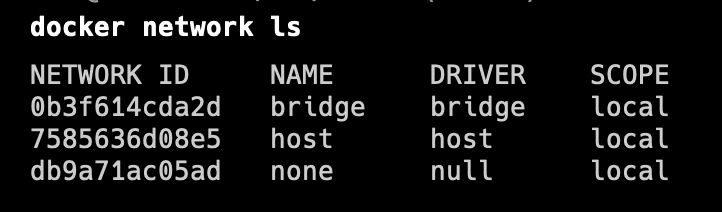
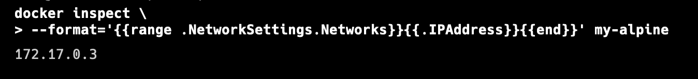

## 默认网络

docker会自动创建三个网络，`bridge`,`host`,`none`


- bridge桥接网络

如果不指定，新创建的容器默认将连接到bridge网络。
默认情况下，使用bridge网络，宿主机可以ping通容器ip，容器中也能ping通宿主机。
容器之间只能通过 IP 地址相互访问，由于容器的ip会随着启动顺序发生变化，因此不推荐使用ip访问。

- host

> 慎用，可能会有安全问题。

容器与宿主机共享网络，不需要映射端口即可通过宿主机IP访问。（-p选项会被忽略）
主机模式网络可用于优化性能，在容器需要处理大量端口的情况下，它不需要网络地址转换 （NAT），并且不会为每个端口创建“用户空间代理”。

- none

禁用容器中所用网络，在启动容器时使用。

## 用户自定义网络

创建用户自定义网络
`docker network create my-net`
将已有容器连接到此网络
`docker network connect my-net db-mysql`
创建容器时指定网络。
`docker run -it --rm --network my-net mysql:5.7 mysql -h**db-mysql** -uroot -p`
在用户自定义网络上，容器之间可以通过容器名进行访问。
用户自定义网络使用 Docker 的嵌入式 DNS 服务器将容器名解析成 IP。

## 主机名解析

#### hostname

容器的hostname默认为容器的 ID。
`docker run -it -d --hostname my-alpine --name my-alpine  alpine:3.15`

```bash
docker inspect \
	--format='{{range .NetworkSettings.Networks}}{{.IPAddress}}{{end}}' my-alpine
```



#### /etc/hosts

在容器内手动修改/etc/hosts文件，容器重启后会恢复默认配置。
要是/etc/hosts修改生效，使用--add-host
`docker run --add-host=my-alpine:172.17.0.3 -it --rm alpine:3.15`

参考文档：
[https://docs.docker.com/network/](https://docs.docker.com/network/)
[https://docs.docker.com/network/bridge/](https://docs.docker.com/network/bridge/)<br/>
[https://docs.docker.com/config/containers/container-networking/](https://docs.docker.com/config/containers/container-networking/)<br/>
[https://docs.docker.com/network/network-tutorial-standalone/](https://docs.docker.com/network/network-tutorial-standalone/#use-user-defined-bridge-networks)

