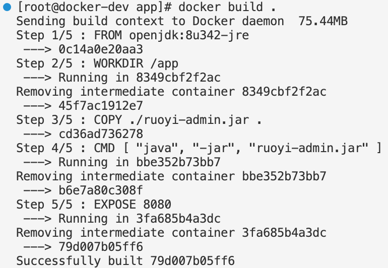

## dockerfile

`dockerfile`通常包含以下几个常用命令：

```dockerfile
FROM ubuntu:18.04
WORKDIR /app
COPY . .
RUN make .
CMD python app.py
EXPOSE 80
```

`FROM` 打包使用的基础镜像
`WORKDIR`相当于`cd`命令，进入工作目录
`COPY` 将宿主机的文件复制到容器内
`RUN`打包时执行的命令，相当于打包过程中在容器中执行shell脚本，通常用来安装应用程序所需要的依赖、设置权限、初始化配置文件等
`CMD`运行镜像时执行的命令
`EXPOSE`指定容器在运行时监听的网络端口，它并不会公开端口，仅起到声明的作用，公开端口需要容器运行时使用-p参数指定。

## 制作自己的镜像

参考我们之前的配置，制作dockerfile文件

```yaml
ruoyi-java:
    image: openjdk:8u342-jre
    ports:
      - 8080:8080
    volumes:
      - /home/app/ruoyi-admin.jar:/usr/local/src/ruoyi-admin.jar
    command: [ "java", "-jar", "/usr/local/src/ruoyi-admin.jar" ]
    networks:
      - ruoyi-net
    depends_on:
      - ruoyi-db
```

编写dockerfile文件

```dockerfile
FROM openjdk:8u342-jre
WORKDIR /app
COPY ./ruoyi-admin.jar .
CMD [ "java", "-jar", "ruoyi-admin.jar" ]
EXPOSE 8080
```

`docker build .` 打包

`docker images` 查看镜像id

`docker tag 79d007b05ff6 ruoyi-app:4.7.4-jar` 设置镜像的标签


## image镜像与layer层

image文件由一系列层构建而成，dockerfile每一个命令都会生成一个层。每一层都是只读的。
例如前面我们制作镜像，就产生了4个层。

也可以使用`docker image history ruoyi-java:4.7.4`命令查看

创建容器时，会创建一个新的可写层，通常称为“容器层”。对正在运行的容器所做的所有更改（如写入新文件、修改现有文件和删除文件）都将写入容器层，而不会修改镜像。


## 多阶段构建

在构建基于 Java 的应用程序时，需要一个 JDK 将源代码编译为 Java 字节码。但是，在生产中不需要该 JDK。
多阶段构建可以将生成时依赖与运行时依赖分开，减小整个image文件大小。

### Maven/Tomcat 示例

使用 Maven来构建应用，在最终的image中不需要包含maven。我们可以使用多阶段构建，每一个阶段从`FROM`开始，最终的image只会从最后一个阶段构建，不会包含前面阶段产生的层，因此可以减少镜像体积。

```dockerfile
FROM maven AS build
WORKDIR /source
COPY . .
RUN mvn package

FROM  openjdk:8u342-jre
WORKDIR /app
COPY --from=build /source/ruoyi-admin/target/ruoyi-admin.jar .
EXPOSE 80
ENTRYPOINT ["java","-jar","ruoyi-admin.jar"]
```

`docker build -t ruoyi-jar:4.7.4 .`

```yaml
# project name
name: "app"

services:

  ruoyi-java:
    image: ruoyi-jar:4.7.4
    command: [
      "--server.port=8080",
      "--ruoyi.profile=/home/ruoyi/uploadPath",
      "--spring.datasource.druid.master.url=jdbc:mysql://ruoyi-db:3306/ry?useUnicode=true&characterEncoding=utf8",
      "--spring.datasource.druid.master.username=root",
      "--spring.datasource.druid.master.password=123456"
    ]
    ports:
      - 8080:8080
    networks:
      - ruoyi-net
    healthcheck:
      test: [ "CMD", "curl", "-f", "http://localhost:8080" ]
      interval: 10s
      timeout: 5s
      retries: 5
      start_period: 10s
    depends_on:
      ruoyi-db:
        condition: service_healthy

  ruoyi-db:
    image: mysql:5.7
    environment:
      - MYSQL_ROOT_PASSWORD=123456
      - MYSQL_DATABASE=ry
    command: [
      "--character-set-server=utf8mb4",
      "--collation-server=utf8mb4_general_ci",
      "--skip-character-set-client-handshake"
    ]
    volumes:
      - /home/app/sql:/docker-entrypoint-initdb.d
      - ruoyi-data:/var/lib/mysql
    networks:
      - ruoyi-net
    healthcheck:
      test: [ "CMD", 'mysqladmin', 'ping', '-h', 'localhost', '-u', 'root', '-p$$MYSQL_ROOT_PASSWORD' ]
      interval: 10s
      timeout: 5s
      retries: 5
      start_period: 10s


volumes:
  ruoyi-data:

networks:
  ruoyi-net:
```

### `ENTRYPOINT`和`CMD`的区别

`dockerfile`应该至少包含一个`ENTRYPOINT`或`CMD`
`ENTRYPOINT`指定容器启动时执行的默认程序,一般运行容器时不会被替换或覆盖。
除非使用`--entrypoint`进行指定。

```bash
docker run -it --entrypoint /bin/bash redis
```

`CMD`可以在启动容器时被替换和覆盖。
例如`docker run -it --rm mysql:5.7 /bin/bash`
如果镜像中`ENTRYPOINT`和`CMD`都存在，则`CMD`将作为`ENTRYPOINT`的参数使用。

参考文档：
[https://docs.docker.com/get-started/09_image_best/](https://docs.docker.com/get-started/09_image_best/)<br/>
[https://docs.docker.com/language/java/build-images/](https://docs.docker.com/language/java/build-images/)<br/>
[https://docs.docker.com/storage/storagedriver/](https://docs.docker.com/storage/storagedriver/)<br/>
[https://docs.docker.com/develop/develop-images/dockerfile_best-practices/](https://docs.docker.com/develop/develop-images/dockerfile_best-practices/)<br/>
[https://docs.docker.com/engine/reference/run/#cmd-default-command-or-options](https://docs.docker.com/engine/reference/run/#cmd-default-command-or-options)

