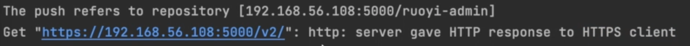
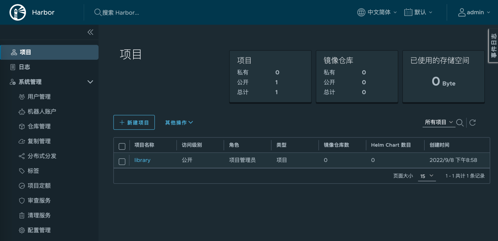
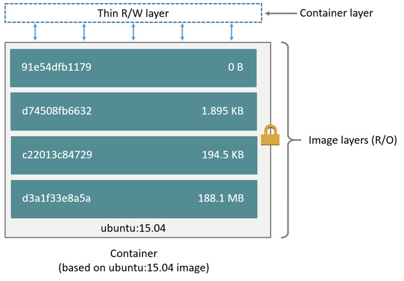

## docker registry

我们可以使用`docker push`将自己的image推送到docker hub中进行共享，但是在实际工作中，很多公司的代码不能上传到公开的仓库中，因此我们可以创建自己的镜像仓库。
docker 官网提供了一个docker registry的私有仓库项目，可以方便的通过docker部署。
`docker run -d -p 5000:5000 --restart always --name registry registry:2`
`docker image tag ruoyi-java:4.7.4 localhost:5000/ruoyi-java:4.7.4`
`docker push localhost:5000/ruoyi-java:4.7.4`
`docker pull localhost:5000/ruoyi-java:4.7.4`
如果遇到以下错误：

这是因为`docker push`默认使用`HTTPS`协议，而服务端的`registry`仓库使用的是`HTTP`。
解决这个问题，需要修改`/etc/docker/daemon.json`，加入

```json
"insecure-registries": ["192.168.56.108:5000"]
```

## harbor

habor是一个功能更强大镜像仓库，它具有完整的权限控制和Web界面，更符合我们的实际工作场景。
下载bitname发布的harbor镜像配置包：[https://github.com/bitnami/containers/archive/main.tar.gz](https://github.com/bitnami/containers/archive/main.tar.gz)

```bash
mkdir harbor
tar xzvf containers-main.tar.gz
cd containers-main/bitnami/harbor-portal
docker compose up -d
```

浏览器访问：[http://192.168.56.108](http://192.168.56.108/harbor/projects)，默认用户名/密码：`admin/bitnami`


## 保存与加载image

当我们处于离线状态，比如在很多内网上不能访问互联网，这时候不能通过镜像仓库的方式共享image，我们可以使用导出和导入功能，手动拷贝镜像。
`docker save`会包含所有层，以及所有标签 + 版本信息。
`docker save alpine:3.15 > alpine-3.15.tar ` 保存image
`docker rmi alpine:3.15` 删除本地image
`docker load < alpine-3.15.tar` 加载image

> 注意：
> 不要跟export和import命令混淆
> `docker save/load IMAGE` save和load操作的是镜像
> `docker export/import CONTAINER`export和import操作对象是容器
> image包含多个层，每一层都不可变，save保存的信息包含每个层和所有标签 + 版本信息。
> 容器运行的时候会创建一个可写入的容器层，所有的更改都写入容器层，export导出的只有容器层，不包含父层和标签信息。
> 

