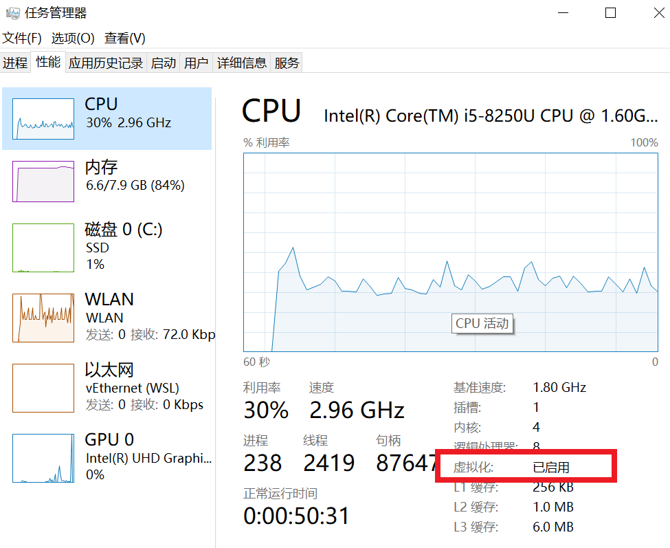
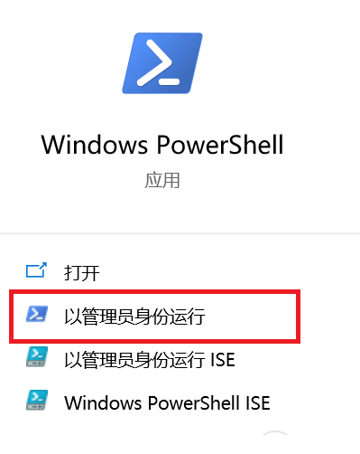
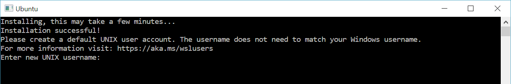
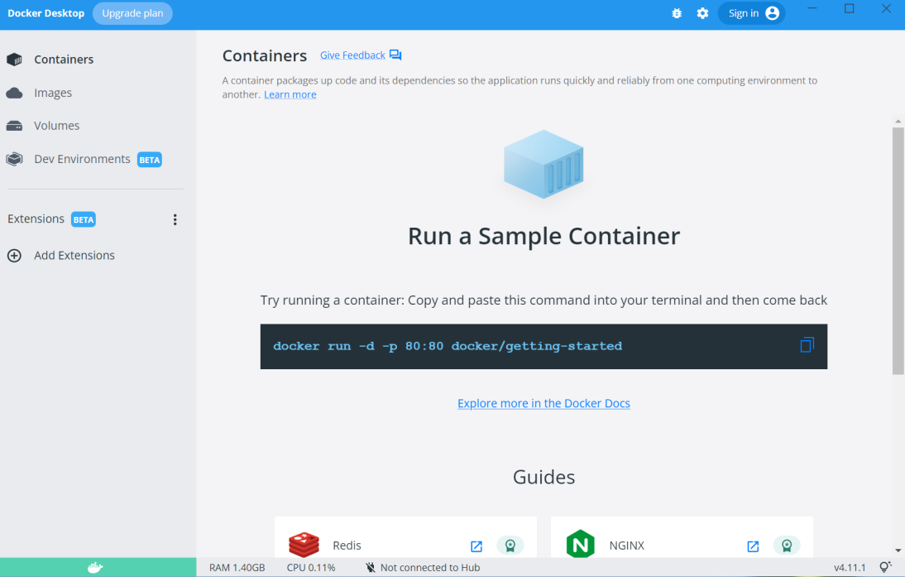
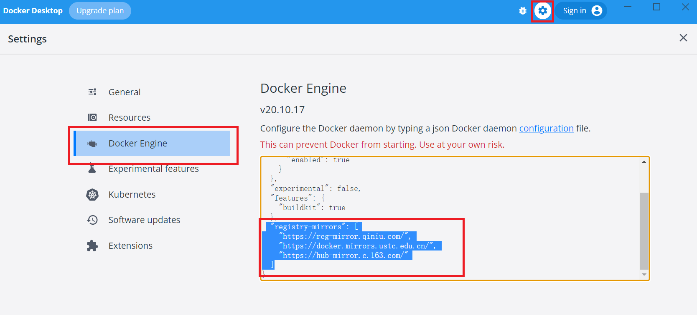

> - **Docker Engine**
>   我们通常所说的docker，是指Docker Engine，它是一种容器化技术，用于创建和运行容器。
> - **Docker Desktop**
>   Docker Desktop是一个用于操作docker的GUI图形界面化工具，它包含Docker Engine。

安装前须知：
[https://docs.docker.com/desktop/faqs/windowsfaqs/](https://docs.docker.com/desktop/faqs/windowsfaqs/)

## 1.Windows下安装Docker Desktop

> 注意事项：
> 1.如果是Windows 7、Windows8 或 Windows Server 用户，建议在虚拟机中安装docker。
> 2.Windows下安装docker可能会有遇到各种问题，如果多次尝试不成功，建议在虚拟机中安装docker。
> 3.如果你电脑上安装了旧版的VMware或VirtualBox，他们可能有冲突。因为Docker 在 Windows 主机中启用 Hyper-V，而Virtualbox 6.1.30，是在Windows上启用Hyper-V的最后一个版本。
> [https://forums.virtualbox.org/viewtopic.php?f=6&t=105951](https://forums.virtualbox.org/viewtopic.php?f=6&t=105951)

#### 1.系统版本要求

- Windows 10 版本 20H2 或更高版本（内部版本 19042 或更高）
- Windows 11
- 在PowerShell中使用`winver`命令查看系统版本

#### 2.启用虚拟化

在“任务管理器”的“性能”选项里查看虚拟化是否启用。如果没有，需要在BIOS中开启。
开启方法参考：[https://bce.berkeley.edu/enabling-virtualization-in-your-pc-bios.html](https://bce.berkeley.edu/enabling-virtualization-in-your-pc-bios.html)


#### 3.安装补丁

下载地址：[https://wslstorestorage.blob.core.windows.net/wslblob/wsl_update_x64.msi](https://wslstorestorage.blob.core.windows.net/wslblob/wsl_update_x64.msi)

> 注意：如果是ARM64架构，请下载[https://wslstorestorage.blob.core.windows.net/wslblob/wsl_update_arm64.msi](https://wslstorestorage.blob.core.windows.net/wslblob/wsl_update_arm64.msi)

#### 4.安装wsl

以管理员身份运行PowerShell

输入以下命令安装wsl
`wsl --install`
WSL安装完成，重启后，输入用户名和密码


> 注意：如果不能运行以上命令，可以手动安装wsl。
> 参考[https://docs.microsoft.com/zh-cn/windows/wsl/install-manual](https://docs.microsoft.com/zh-cn/windows/wsl/install-manual)

#### 5.安装docker desktop

下载[Docker Desktop for Windows](https://desktop.docker.com/win/main/amd64/Docker%20Desktop%20Installer.exe)进行安装。出现以下界面，安装成功。


#### 6.配置镜像站

由于访问docker hub网络比较慢，因此需要配置国内的容器仓库镜像站。


```json
{
  "builder": {
    "gc": {
      "defaultKeepStorage": "20GB",
      "enabled": true
    }
  },
  "experimental": false,
  "features": {
    "buildkit": true
  },
  "registry-mirrors": [
    "https://reg-mirror.qiniu.com/",
    "https://docker.mirrors.ustc.edu.cn/",
    "https://hub-mirror.c.163.com/"
  ]
}
```

参考文档：
[https://docs.docker.com/desktop/windows/wsl/](https://docs.docker.com/desktop/windows/wsl/)<br/>
[https://docs.microsoft.com/zh-cn/windows/wsl/install](https://docs.microsoft.com/zh-cn/windows/wsl/install)<br/>
[https://docs.microsoft.com/zh-cn/windows/wsl/install-manual](https://docs.microsoft.com/zh-cn/windows/wsl/install-manual)<br/>
[https://docs.docker.com/desktop/troubleshoot/topics/#topics-for-windows](https://docs.docker.com/desktop/troubleshoot/topics/#topics-for-windows)

## 2.注意事项

- 挂载路径写法，windows路径使用`\`

`docker run --rm -ti -v C:\Users\user\work:/work alpine:3.15`

- 开机启动Hypervisor

某些工具（例如旧版本的Virtual Box）和视频游戏安装程序会在启动时禁用虚拟机管理程序。需要要重新启用它。

1. 使用管理员权限打开命令行。
2. `bcdedit /set hypervisorlaunchtype auto `
3. 关闭重新打开命令行窗口。

- 换行符

‎Docker 容器基于 Linux环境中运行，在容器内运行的文件都必须使用 linux 样式的换行符 `\n`，不能使用windows换行符`\r\n`。
例如dockerfile文件，windows下的一些工具会默认使用windows换行符，因此这些文件在容器中运行可能会显示语法错误。

参考文档：
[https://docs.docker.com/desktop/troubleshoot/topics/](https://docs.docker.com/desktop/troubleshoot/topics/)

