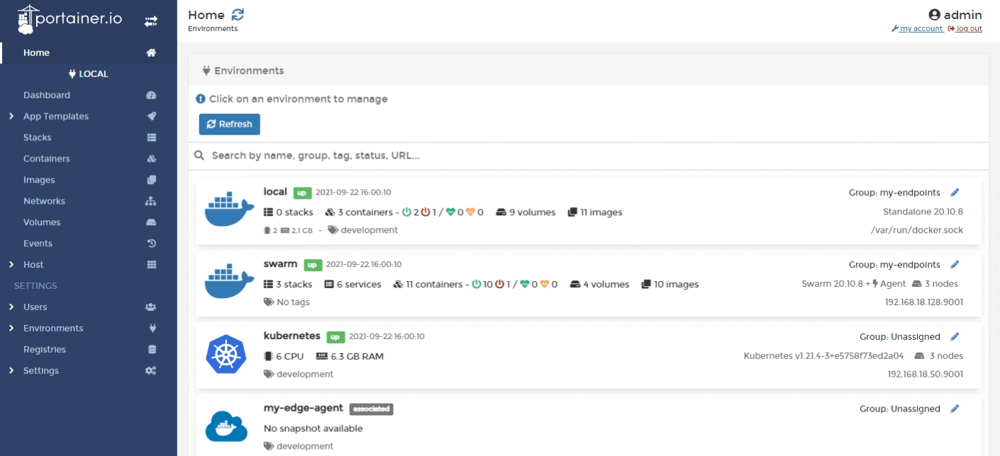

## portainer

Portainer是一个可视化的Docker管理系统，功能十分全面，提供状态显示面板、应用模板快速部署、容器镜像、网络、数据卷的基本操作、事件日志显示、容器控制台操作、登录用户管理和控制等功能。


## 使用docker部署portainer

```bash
docker volume create portainer_data

docker run -d -p 8000:8000 -p 9443:9443 \
           -v /var/run/docker.sock:/var/run/docker.sock \
           -v portainer_data:/data \
           --restart=always \
           --name portainer portainer/portainer-ce:2.14.2
```

打开浏览器访问：[https://192.168.56.105:9443/](https://192.168.56.105:9443/#!/auth)

## 重启策略

容器的重启策略。
`docker run --restart=always IMAGE:TAG`
`--restart=no` 默认为no，不会自动重启容器。
`--restart=always` 当容器停止运行时，总是重启容器。当我们重启docker进程时，也会自动重启容器。如果我们使用`docker stop`停止容器时，则不会自动重启容器。
`--restart=on-failure:10` 仅当容器以异常状态退出时，才重启容器。若重启不成功，最多尝试重启 10次。
`--restart=unless-stopped` 当我们重启docker时，若这个容器已经处停止状态，则不进行自动重启。

