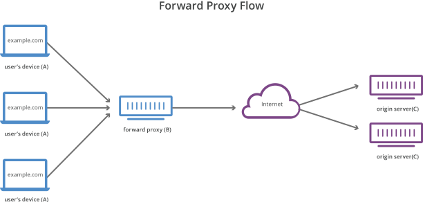
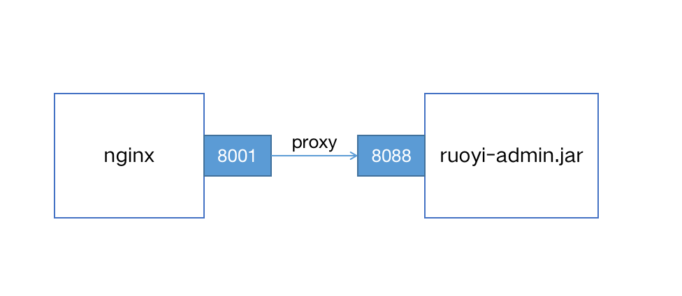

#### 1.正向代理与反向代理

- **正向代理**

在**客户端**代理转发请求称为**正向代理**。例如VPN。


- **反向代理**

在**服务器端**代理转发请求称为**反向代理**。例如nginx


#### 2.配置代理服务



> RuoYi是一个基于Spring Boot的后台管理系统，ruoyi-admin.jar可以从网盘中获取
> 网盘链接: [https://pan.baidu.com/s/1NmCR-vdAcZLouRRn9V1yTA](https://pan.baidu.com/s/1NmCR-vdAcZLouRRn9V1yTA)  密码: 1b60
> 也可以根据官网文档（[http://doc.ruoyi.vip/ruoyi/](http://doc.ruoyi.vip/ruoyi/)），自己编译打包。
> 源码下载：[https://codeload.github.com/yangzongzhuan/RuoYi/zip/refs/tags/v4.7.4](https://codeload.github.com/yangzongzhuan/RuoYi/zip/refs/tags/v4.7.4)

启动ruoyi后台服务，端口为8088；

```bash
java -jar ruoyi-admin.jar
```

nginx配置文件：

```nginx
server {
  
  listen 8001;
  
  server_name ruoyi.localhost;
  
  location / {
    proxy_pass http://localhost:8088;
  }

}
```

**proxy_pass配置说明：**

```nginx
location /some/path/ {
    proxy_pass http://localhost:8080;
}
```

- 如果`proxy-pass`的地址只配置到端口，不包含`/`或其他路径，那么location将被追加到转发地址中

如上所示，访问 `http://localhost/some/path/page.html` 将被代理到 `http://localhost:8080/some/path/page.html`

```nginx
location /some/path/ {
    proxy_pass http://localhost:8080/zh-cn/;
}
```

- 如果`proxy-pass`的地址包括`/`或其他路径，那么/some/path将会被替换，如上所示，访问 `http://localhost/some/path/page.html` 将被代理到 `http://localhost:8080/zh-cn/page.html`。‎

#### 3.设置代理请求headers

‎用户可以重新定义或追加header信息传递给后端[‎](http://nginx.org/en/docs/http/ngx_http_proxy_module.html#proxy_pass_request_headers)‎服务器。可以包含文本、变量及其组合。默认情况下，仅重定义两个字段：‎

```nginx
proxy_set_header Host       $proxy_host;
proxy_set_header Connection close;
```

由于使用反向代理之后，后端服务无法获取用户的真实IP，所以，一般反向代理都会设置以下header信息。

```nginx
location /some/path/ {
    #nginx的主机地址
    proxy_set_header Host $http_host;
    #用户端真实的IP，即客户端IP
    proxy_set_header X-Real-IP $remote_addr;
    proxy_set_header X-Forwarded-For $proxy_add_x_forwarded_for;

    proxy_pass http://localhost:8088;
}
```

常用变量的值：
`$host`：nginx主机IP，例如192.168.56.105
`$http_host`：nginx主机IP和端口，192.168.56.105:8001
`$proxy_host`：localhost:8088，proxy_pass里配置的主机名和端口
`$remote_addr`:用户的真实IP，即客户端IP。

#### 4.非HTTP代理

如果要将请求传递到非 HTTP 代理服务器，可以使用下列指令：

- [fastcgi_pass](https://nginx.org/en/docs/http/ngx_http_fastcgi_module.html#fastcgi_pass) 将请求转发到FastCGI服务器（多用于PHP）
- [scgi_pass](https://nginx.org/en/docs/http/ngx_http_scgi_module.html#scgi_pass) 将请求转发到SCGI server服务器（多用于PHP）
- [uwsgi_pass](https://nginx.org/en/docs/http/ngx_http_uwsgi_module.html#uwsgi_pass) 将请求转发到uwsgi服务器（多用于python）
- [memcached_pass](https://nginx.org/en/docs/http/ngx_http_memcached_module.html#memcached_pass) 将请求转发到memcached服务器

参考文档：
[https://nginx.org/en/docs/beginners_guide.html](https://nginx.org/en/docs/beginners_guide.html)<br/>
[https://docs.nginx.com/nginx/admin-guide/web-server/reverse-proxy/](https://docs.nginx.com/nginx/admin-guide/web-server/reverse-proxy/)<br/>
[http://nginx.org/en/docs/http/ngx_http_proxy_module.html#proxy_set_header](http://nginx.org/en/docs/http/ngx_http_proxy_module.html#proxy_set_header)

