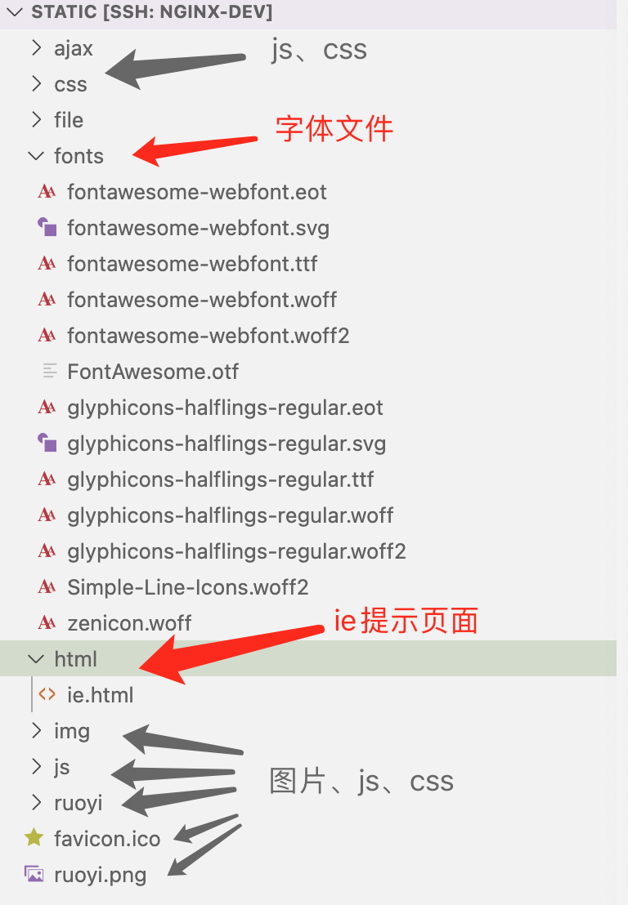

#### 动静分离的好处

Apache Tocmat 严格来说是一款java EE服务器，主要是用来处理 servlet请求。处理css、js、图片这些静态文件的IO性能不够好，因此，将静态文件交给nginx处理，可以提高系统的访问速度，减少tomcat的请求次数，有效的给后端服务器降压。

#### 分离静态文件


> RuoYi是一个基于Spring Boot的后台管理系统，ruoyi-admin.war可以从网盘中获取
> 网盘链接: [https://pan.baidu.com/s/1NmCR-vdAcZLouRRn9V1yTA](https://pan.baidu.com/s/1NmCR-vdAcZLouRRn9V1yTA)  密码: 1b60
> 也可以根据官网文档（[http://doc.ruoyi.vip/ruoyi/](http://doc.ruoyi.vip/ruoyi/)），自己编译打包。
> 源码下载：[https://codeload.github.com/yangzongzhuan/RuoYi/zip/refs/tags/v4.7.4](https://codeload.github.com/yangzongzhuan/RuoYi/zip/refs/tags/v4.7.4)

部署ruoyi-admin.war

```bash
mv /home/apps/ruoyi-admin.war /home/apache-tomcat-8.5.81/webapps/ROOT.war
rm -rf /home/apache-tomcat-8.5.81/webapps/ROOT
/home/apache-tomcat-8.5.81/bin/startup.sh
```

部署完成后，对项目目录稍作调整

```shell
cd /home/apache-tomcat-8.5.81/webapps/ROOT
mv WEB-INF/classes/static/i18n  WEB-INF/classes/templates/i18n 
mv WEB-INF/classes/static /home/www/
```

修改application.yml

```yaml
messages:
    # 国际化资源文件路径 
    # 将 static/i18n/messages 修改为 templates/i18n/messages
    basename: templates/i18n/messages
```

静态文件目录说明：
除了js、css、图片文件之外，还有字体文件和一个ie提示页面。


```nginx
server{


  location / {
    proxy_pass http://localhost:8080/;
  }
  
  location = /html/ie.html {
    root  /home/www/static;
  }
  
  location ^~ /fonts/ {
   
    root  /home/www/static;
  }
  
  location ~ \.(css|js|png|jpg|gif|ico) {
    root /home/www/static;
}
```

#### location 修饰符

- location可以使用修饰符或正则表达式

修饰符：
=     等于，严格匹配 ，匹配优先级最高。
^~  表示普通字符匹配。使用前缀匹配。如果匹配成功，则不再匹配其它 location。优先级第二高。
~     区分大小写
~*  不区分大小写

- 优先级

优先级从高到低依次为：。

1. 精确匹配（=）
2. 前缀匹配（^~）
3. 正则匹配（~和～*）
4. 不写

```nginx
location ^~ /images/ {
    proxy_pass http://localhost:8080;
}

location ~ \.jpg {
    proxy_pass http://localhost:8080;
}
```

如上所示：
`/images/1.jpg`代理到 `http://localhost:8080/images/1.jpg`
`/some/path/1.jpg` 代理到`http://localhost:8080/some/path/1.jpg`

参考文档：
[https://nginx.org/en/docs/beginners_guide.html](https://nginx.org/en/docs/beginners_guide.html)
[https://nginx.org/en/docs/http/ngx_http_core_module.html#location](https://nginx.org/en/docs/http/ngx_http_core_module.html#location)
[https://docs.nginx.com/nginx/admin-guide/web-server/serving-static-content/](https://docs.nginx.com/nginx/admin-guide/web-server/serving-static-content/)

