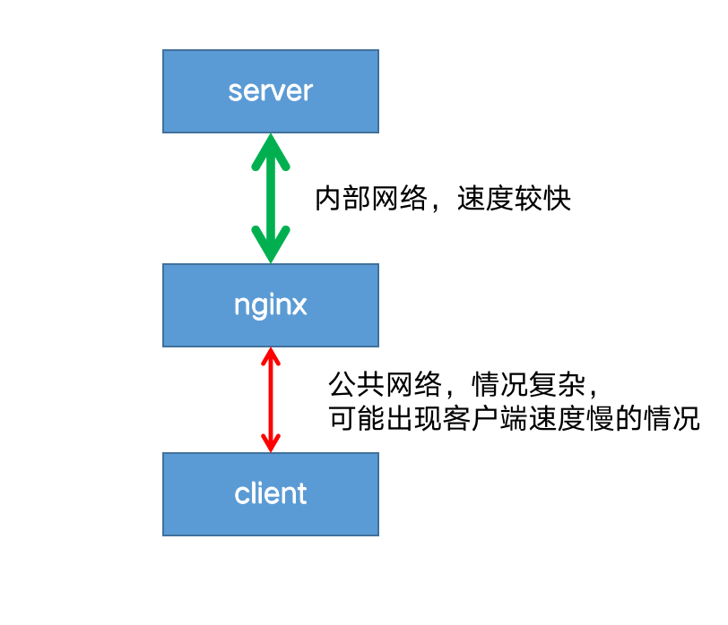
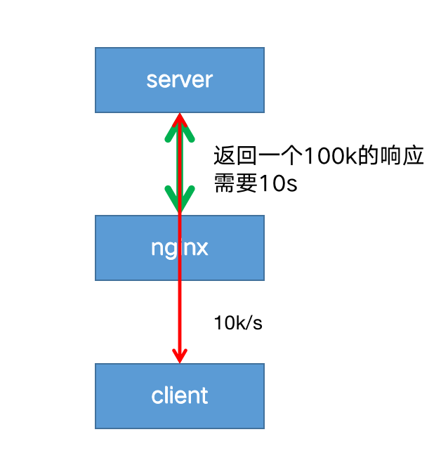
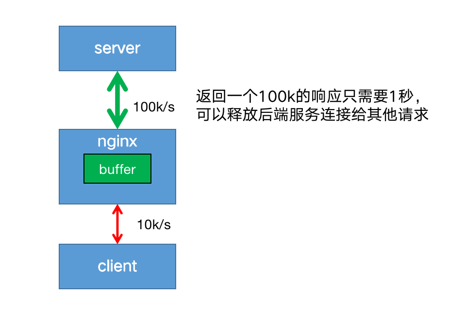
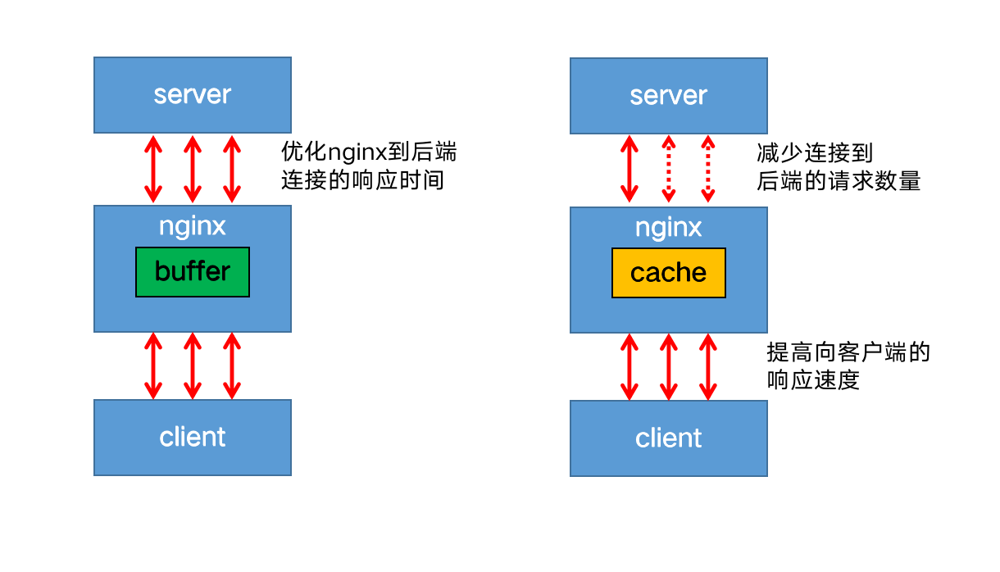

### 缓冲（buffer）

缓冲一般放在内存中，如果不适合放入内存（比如超过了指定大小），则会将响应写入磁盘临时文件中。
启用缓冲后，nginx先将后端的请求响应（response）放入缓冲区中，等到整个响应完成后，再发给客户端。

客户端往往是用户网络，情况复杂，可能出现网络不稳定，速度较慢的情况。
而nginx到后端server一般处于同一个机房或者区域，网速稳定且速度极快。

如果禁用了缓冲，则在客户端从代理服务器接收响应时，响应将同步发送到客户端。对于需要尽快开始接收响应的快速交互式客户端，此行为可能是可取的。
这就会带来一个问题：因为客户端到nginx的网速过慢，导致nginx只能以一个较慢的速度将响应传给客户端；进而导致后端server也只能以同样较慢的速度传递响应给nginx，造成一次请求连接耗时过长。
在高并发的情况下，后端server可能会出现大量的连接积压，最终拖垮server端。

开启代理缓冲后，nginx可以用较快的速度尽可能将响应体读取并缓冲到本地内存或磁盘中，然后同时根据客户端的网络质量以合适的网速将响应传递给客户端。
这样既解决了server端连接过多的问题，也保证了能持续稳定的像客户端传递响应。
使用[proxy_buffering](https://nginx.org/en/docs/http/ngx_http_proxy_module.html#proxy_buffering)启用和禁用缓冲，nginx默认为 on 启用缓冲，若要关闭，设置为 off  。

```nginx
proxy_buffering off;
```

[proxy_buffers](https://nginx.org/en/docs/http/ngx_http_proxy_module.html#proxy_buffers) 指令设置每个连接读取响应的缓冲区的`大小`和`数量` 。默认情况下，缓冲区大小等于一个内存页，4K 或 8K，具体取决于操作系统。
来自后端服务器响应的第一部分存储在单独的缓冲区中，其大小通过 [proxy_buffer_size](https://nginx.org/en/docs/http/ngx_http_proxy_module.html#proxy_buffer_size) 指令进行设置，此部分通常是相对较小的响应headers，通常将其设置成小于默认值。

```nginx
location / {
    proxy_buffers 16 4k;
    proxy_buffer_size 2k;
    proxy_pass http://localhost:8088;
}
```

如果整个响应不适合存到内存里，则将其中的一部分保存到磁盘上的‎‎临时文件中‎‎。
‎[‎proxy_max_temp_file_size‎](https://nginx.org/en/docs/http/ngx_http_proxy_module.html#proxy_max_temp_file_size)‎设置临时文件的最大值。
‎[‎proxy_temp_file_write_size‎](https://nginx.org/en/docs/http/ngx_http_proxy_module.html#proxy_temp_file_write_size)‎设置一次写入临时文件的大小。

### 缓存（cache）

启用缓存后，nginx将响应保存在磁盘中，返回给客户端的数据首先从缓存中获取，这样子相同的请求不用每次都发送给后端服务器，减少到后端请求的数量。

启用缓存，需要在http上下文中使用 [proxy_cache_path](https://nginx.org/en/docs/http/ngx_http_proxy_module.html#proxy_cache_path) 指令，定义缓存的本地文件目录，名称和大小。
缓存区可以被多个server共享，使用[proxy_cache](https://nginx.org/en/docs/http/ngx_http_proxy_module.html#proxy_cache) 指定使用哪个缓存区。

```nginx
http {
    proxy_cache_path /data/nginx/cache keys_zone=mycache:10m;
    server {
        proxy_cache mycache;
        location / {
            proxy_pass http://localhost:8000;
        }
    }
}
```

缓存目录的文件名是 [proxy_cache_key](https://nginx.org/en/docs/http/ngx_http_proxy_module.html#proxy_cache_key) 的MD5值。
例如：`/data/nginx/cache/**c**/**29**/b7f54b2df7773722d382f4809d650**29c**`
[proxy_cache_key](https://nginx.org/en/docs/http/ngx_http_proxy_module.html#proxy_cache_key) 默认设置如下：

```nginx
proxy_cache_key $scheme$proxy_host$uri$is_args$args;
```

也可以自定义缓存的键，例如

```nginx
proxy_cache_key "$host$request_uri$cookie_user";
```

缓存不应该设置的太敏感，可以使用[proxy_cache_min_uses](https://nginx.org/en/docs/http/ngx_http_proxy_module.html#proxy_cache_min_uses)设置相同的key的请求，访问次数超过指定数量才会被缓存。

```nginx
proxy_cache_min_uses 5;
```

默认情况下，响应无限期地保留在缓存中。仅当缓存超过最大配置大小时，按照时间删除最旧的数据。

### 示例

```nginx
proxy_cache_path /var/cache/nginx/data keys_zone=mycache:10m;

server {

    listen 8001;
    server_name ruoyi.localhost;
    
    location / {
        #设置buffer
        proxy_buffers 16 4k;
        proxy_buffer_size 2k;
        proxy_pass http://localhost:8088;        

    }


    location ~ \.(js|css|png|jpg|gif|ico) {
        #设置cache
        proxy_cache mycache;
        proxy_cache_valid 200 302 10m;
        proxy_cache_valid 404      1m;
        proxy_cache_valid any 5m;

        proxy_pass http://localhost:8088;  
    }

    location = /html/ie.html {

        proxy_cache mycache;
        proxy_cache_valid 200 302 10m;
        proxy_cache_valid 404      1m;
        proxy_cache_valid any 5m;

        proxy_pass http://localhost:8088;  
    }

    location ^~ /fonts/ {

        proxy_cache mycache;
        proxy_cache_valid 200 302 10m;
        proxy_cache_valid 404      1m;
        proxy_cache_valid any 5m;

        proxy_pass http://localhost:8088;  
    }

}
```

参考文档：
[https://docs.nginx.com/nginx/admin-guide/web-server/reverse-proxy/](https://docs.nginx.com/nginx/admin-guide/web-server/reverse-proxy/)<br/>
[https://nginx.org/en/docs/http/ngx_http_proxy_module.html#proxy_buffer_size](https://nginx.org/en/docs/http/ngx_http_proxy_module.html#proxy_buffer_size)<br/>
[https://docs.nginx.com/nginx/admin-guide/content-cache/content-caching/](https://docs.nginx.com/nginx/admin-guide/content-cache/content-caching/)<br/>
[http://nginx.org/en/docs/http/ngx_http_proxy_module.html#proxy_cache_path](http://nginx.org/en/docs/http/ngx_http_proxy_module.html#proxy_cache_path)

