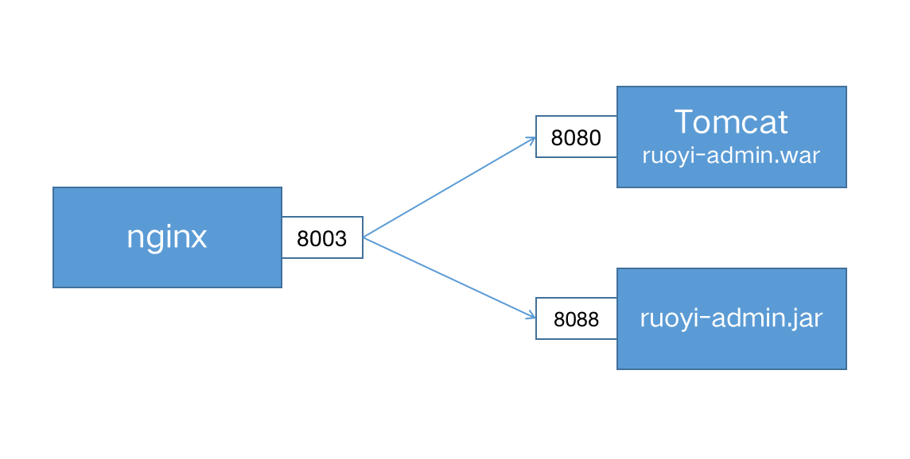
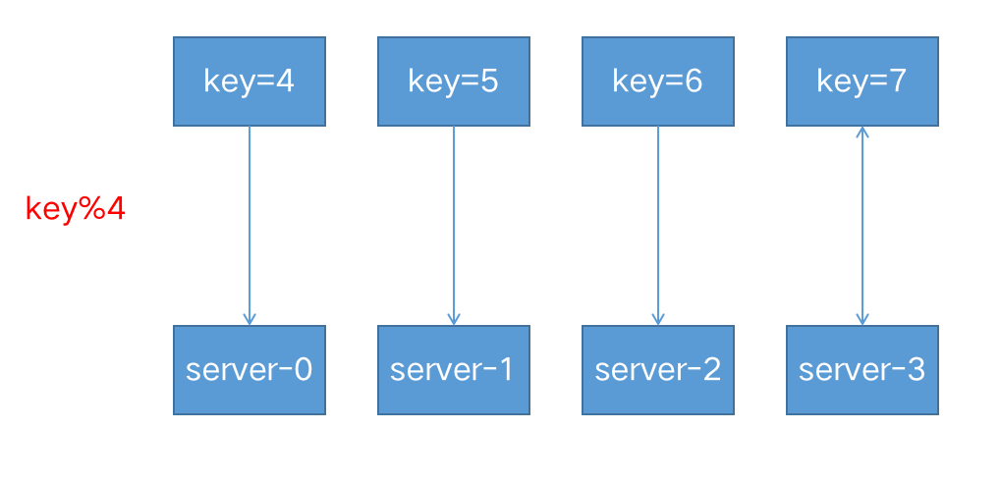
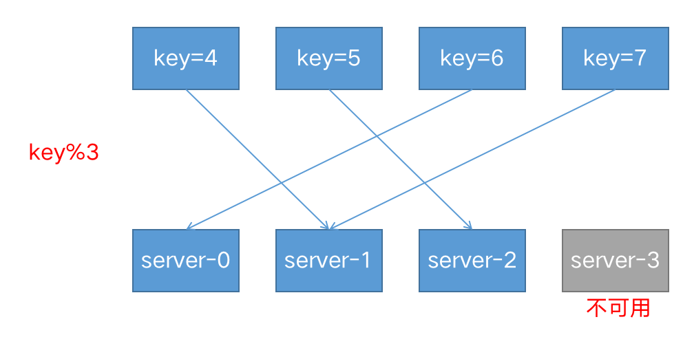
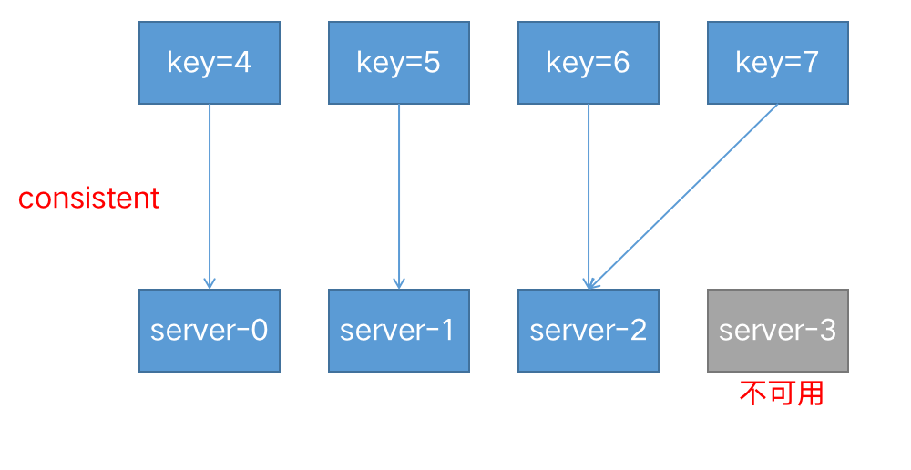
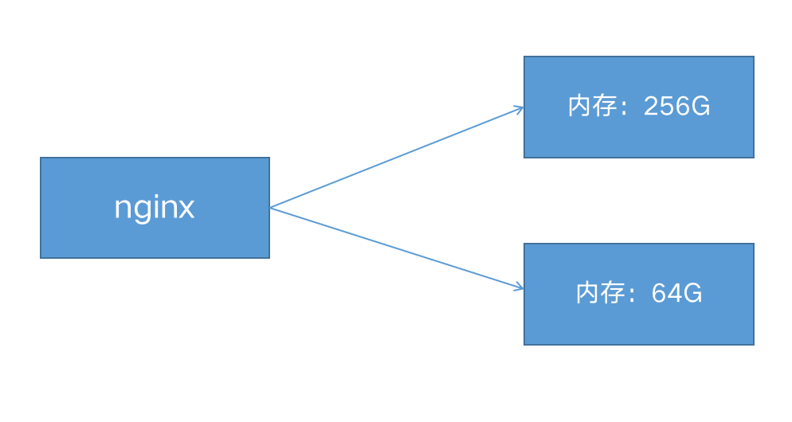

跨多个应用程序实例的负载平衡是一种常用技术，用于优化资源利用率、最大化吞吐量、减少延迟和确保容错配置。‎使用nginx作为非常有效的HTTP负载平衡器，将流量分配到多个应用程序服务器，可以提升Web应用程序的性能，提高扩展性和可靠性。

### 配置服务组



使用 `upstream`定义一组服务 。

> 注意：upstream 位于 http上下文中，与server 并列，不要放在server中。

```nginx
upstream ruoyi-apps {
    #不写，采用轮循机制
    server localhost:8080;
    server localhost:8088;
  
}

server {
  
  listen 8003;
  server_name ruoyi.loadbalance;
  
  location / {
    proxy_pass http://ruoyi-apps;
  }

}
```

### 负载均衡策略

#### 1.轮循机制（round-robin）

默认机制，以轮循机制方式分发。

#### 2.[最小连接](https://nginx.org/en/docs/http/ngx_http_upstream_module.html#least_conn)（least-connected ）

将下一个请求分配给活动连接数最少的服务器（较为空闲的服务器）。‎

```nginx
upstream backend {
    least_conn;
    server backend1.example.com;
    server backend2.example.com;
}
```

> 请注意，使用轮循机制或最少连接的负载平衡，每个客户端的请求都可能分发到不同的服务器。不能保证同一客户端将始终定向到同一服务器。‎

#### 3.[ip-hash](https://nginx.org/en/docs/http/ngx_http_upstream_module.html#ip_hash)

客户端的 IP 地址将用作哈希键，来自同一个ip的请求会被转发到相同的服务器。

```nginx
upstream backend {
    ip_hash;
    server backend1.example.com;
    server backend2.example.com;
}
```

> 此方法可确保来自同一客户端的请求将始终定向到同一服务器，除非此服务器不可用。‎

#### [‎4.hash](https://nginx.org/en/docs/http/ngx_http_upstream_module.html#hash)

通用hash，允许用户自定义hash的key，key可以是字符串、变量或组合。
例如，key可以是配对的源 IP 地址和端口，也可以是 URI，如以下示例所示：‎

```nginx
upstream backend {
    hash $request_uri consistent;
    server backend1.example.com;
    server backend2.example.com;
}
```

> 请注意：基于 IP 的哈希算法存在一个问题，那就是当有一个上游服务器宕机或者扩容的时候，会引发大量的路由变更，进而引发连锁反应，导致大量缓存失效等问题。

`consistent`参数启用 ‎[‎ketama‎](http://www.last.fm/user/RJ/journal/2007/04/10/rz_libketama_-_a_consistent_hashing_algo_for_memcache_clients)‎ 一致哈希算法，如果在上游组中添加或删除服务器，只会重新映射部分键，从而最大限度地减少缓存失效。‎
假设我们基于 key 来做 hash，现在有 4 台上游服务器，如果 hash 算法对 key 取模，请求根据用户定义的哈希键值均匀分布在所有上游服务器之间。

当有一台服务器宕机的时候，就需要重新对 key 进行 hash，最后会发现所有的对应关系全都失效了，从而会引发缓存大范围失效。




#### 5.[‎随机‎](https://nginx.org/en/docs/http/ngx_http_upstream_module.html#random)‎  (random）

每个请求都将传递到随机选择的服务器。
two是可选参数，NGINX 在考虑服务器权重的情况下随机选择两台服务器，然后使用指定的方法选择其中一台，默认为选择连接数最少（least_conn‎）的服务器。

```nginx
upstream backend {
    random two least_conn;
    server backend1.example.com;
    server backend2.example.com;
    server backend3.example.com;
    server backend4.example.com;
}
```

#### 6.权重（weight）



```nginx
upstream my-server {
  
    server performance.server weight=3;
    server app1.server;
    server app2.server;

}
```

‎如上所示，每 5 个新请求将按如下方式分布在应用程序实例中：3 个请求将定向到performance.server，一个请求将转到app1.server，另一个请求将转到app2.server。‎

#### 7.健康检查

在反向代理中，如果后端服务器在某个周期内响应失败次数超过规定值，nginx会将此服务器标记为失败，并在之后的一个周期不再将请求发送给这台服务器。‎
通过[fail_timeout‎](https://nginx.org/en/docs/http/ngx_http_upstream_module.html#fail_timeout)‎ 来设置检查周期，默认为10秒。
通过[max_fails‎](https://nginx.org/en/docs/http/ngx_http_upstream_module.html#max_fails)来设置检查失败次数，默认为1次。‎
‎在以下示例中，如果NGINX无法向服务器发送请求或在30秒内请求失败次数超过3次，则会将服务器标记为不可用30秒。

```nginx
upstream backend {
  server backend1.example.com;
  server backend2.example.com max_fails=3 fail_timeout=30s; 
}
```

参考文档：
[https://nginx.org/en/docs/http/load_balancing.html](https://nginx.org/en/docs/http/load_balancing.html)<br/>
[https://docs.nginx.com/nginx/admin-guide/load-balancer/http-load-balancer/](https://docs.nginx.com/nginx/admin-guide/load-balancer/http-load-balancer/)

