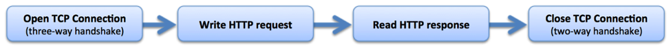
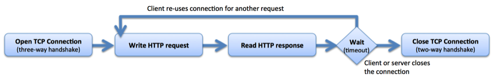

### 1.stream

```nginx
#HTTP代理
http {
  server {
    listen 8002;
    proxy_pass http://localhost:8080/;
  }
}

#TCP代理
stream {
  server {
    listen 13306;
    proxy_pass localhost:3306;
  }
}
```

### 2.tcp负载均衡

```nginx
stream {
  
  upstream backend-mysql {
  
    server localhost:3306;
    server localhost:3307;
    
    keepalive 8;
  }
  
  server {
    listen 13306;
    proxy_pass backend-mysql;
  }
}
```

使用`**keepalive**`定义连接池里空闲连接的数量。
`**keepalive_timeout**`** **默认60s。如果连接池里的连接空闲时间超过这个值，则连接关闭。
在最简单的 HTTP 实现中，客户端打开新连接，写入请求，读取响应，然后关闭连接以释放关联的资源。

在客户端读取响应后，保持连接处于打开状态，因此可以将其重新用于后续请求。

使用 [keepalive](https://nginx.org/en/docs/http/ngx_http_upstream_module.html#keepalive) 指令启用从 NGINX Plus 到上游服务器的保持活动连接，定义在每个工作进程的缓存中保留的与上游服务器的空闲保持活动连接的最大数量。当超过此数字时，将关闭最近最少使用的连接。如果没有 keepalives，您将增加更多的开销，并且连接和临时端口都效率低下。
现代 Web 浏览器通常会打开 6 到 8 个保持连接。

参考文档：
[https://nginx.org/en/docs/http/ngx_http_upstream_module.html#keepalive](https://nginx.org/en/docs/http/ngx_http_upstream_module.html#keepalive)<br>
[https://docs.nginx.com/nginx/admin-guide/load-balancer/tcp-udp-load-balancer/](https://docs.nginx.com/nginx/admin-guide/load-balancer/tcp-udp-load-balancer/)<br>
[https://www.nginx.com/blog/http-keepalives-and-web-performance/](https://www.nginx.com/blog/http-keepalives-and-web-performance/)<br>
[https://www.nginx.com/blog/overcoming-ephemeral-port-exhaustion-nginx-plus/](https://www.nginx.com/blog/overcoming-ephemeral-port-exhaustion-nginx-plus/)

