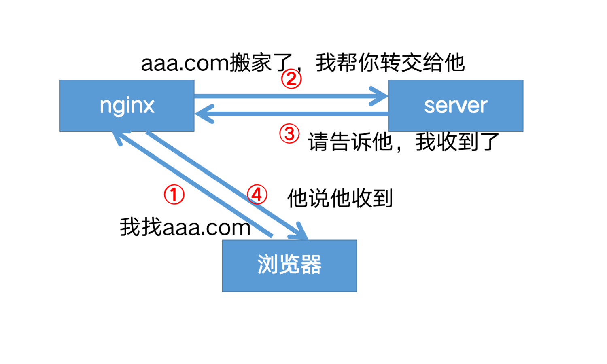
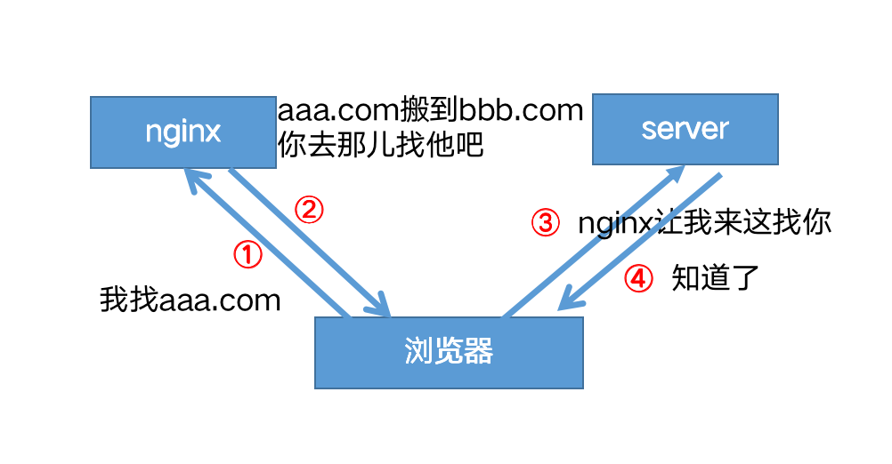

nginx有两个重写指令：`return`和`rewrite`

## return

服务端停止处理并将状态码status code返回给客户端

```nginx
return _code_ _URL_
return _code_ _text_
return _code_
return _URL_
```

### 强制所有请求使用Https

错误写法

```nginx
server {

    listen 8003;
    server_name ruoyi.loadbalance;

    return 301 https://localhost:8004;
}
```

正确写法

```nginx
server {

    listen 8003;
    server_name ruoyi.loadbalance;

    return 301 https://192.168.56.105:8004;
}
```

## 转发和重定向

转发是服务端行为，重定向是客户端行为。

#### 转发

发向代理proxy_pass属于转发，浏览器的访问栏输入的地址不会发生变化。


#### 重定向

return，rewrite属于重定向，在客户端进行。浏览器的访问栏输入的地址会发生变化。

域名迁移，不让用户收藏的链接或者搜索引擎的链接失效
将请求从 www.old-name.com **old-name.com** 永久重定向到 **www.new-name.com，包含http和https请求**

```nginx
server {
    listen 80;
    listen 443 ssl;
    server_name www.old-name.com old-name.com;
    return 301 $scheme://www.new-name.com$request_uri;
}
```

由于捕获了域名后面的 URL 部分，因此，如果新旧网站之间存在一对一的页面对应关系（例如，**www.new-name.com/about** 具有与 **www.old-name.com/about** 相同的基本内容），则此重写是合适的。如果除了更改域名之外还重新组织了网站，则通过省略以下内容，将所有请求重定向到主页可能会更安全

```nginx
server {
    listen 80;
    listen 443 ssl;
    server_name www.old-name.com old-name.com;
    return 301 $scheme://www.new-name.com;
}
```

添加www

```nginx
# add 'www'
server {
    listen 80;
    listen 443 ssl;
    server_name domain.com;
    return 301 $scheme://www.domain.com$request_uri;
}
```

#### 状态码

- 2xx 成功
- 3xx 表示重定向
  - 301 永久重定向
  - 302 临时重定向
- 4xx 请求地址出错
  - 403 拒绝请求
  - 404 请求找不到
- 5xx 服务器内部错误

## rewrite

‎如果指定的正则表达式与请求 URI 匹配，则 URI 将按照字符串中的指定进行更改。指令按其在配置文件中出现的先后顺序执行。

```nginx
server {
    # ...
    rewrite ^(/download/.*)/media/(\w+)\.?.*$ $1/mp3/$2.mp3 last;
    rewrite ^(/download/.*)/audio/(\w+)\.?.*$ $1/mp3/$2.ra  last;
    return  403;
    # ...
}
```

上面是使用该指令的示例 NGINX 重写规则。它匹配以字符串 **/download** 开头的 URL，然后在路径后面的某个位置包含 **/media**/ 或 **/audio/** 目录。它将这些元素替换为 **/mp3/，**并添加相应的文件扩展名**，.mp3** 或 **.ra**。和 变量捕获未更改的路径元素。例如，**/download/cdn-west/media/file1** 变成了 **/download/cdn-west/mp3/file1.mp3**。如果文件名上有扩展名（如 **.flv**），则表达式会将其剥离，并将其替换为**.mp3**。
如果字符串包含新的请求参数，则以前的请求参数将追加到这些参数之后。如果不需要这样做，则在替换字符串的末尾放置一个问号可以避免附加它们，例如：_replacement_

```nginx
rewrite ^/users/(.*)$ /show?user=$1? last;
```

## last与break

`last`：如果当前规则不匹配，停止处理后续rewrite规则，使用重写后的路径，重新搜索location及其块内指令
`break`:如果当前规则不匹配，停止处理后续rewrite规则，执行{}块内其他指令

### 不使用last和break

在root /home/AdminLTE-3.2.0/pages下创建一个1.txt，里面内容是`this is a file`

```nginx
server {

    listen 8000;
    server_name nginx-dev;

    rewrite_log on;

    location / {
        rewrite ^/old/(.*) /new/$1;
        rewrite ^/new/(.*) /pages/$1;
        #根目录
        root /home/AdminLTE-3.2.0;
        #首页
        index index.html index2.html index3.html;
    }

    location  /pages/1.txt {
        return 200 "this is rewrite test!";
    }

}
```

默认按顺序执行。
访问 http://192.168.56.105:8000/old/1.txt
结果：`this is rewrite test!`
日志：

```latex
[notice] 26837#26837: *1181 "^/old/(.*)" matches "/old/1.txt", client: 192.168.56.1, server: nginx-dev, request: "GET /old/1.txt HTTP/1.1", host: "192.168.56.105:8000"
[notice] 26837#26837: *1181 rewritten data: "/new/1.txt", args: "", client: 192.168.56.1, server: nginx-dev, request: "GET /old/1.txt HTTP/1.1", host: "192.168.56.105:8000"
[notice] 26837#26837: *1181 "^/new/(.*)" matches "/new/1.txt", client: 192.168.56.1, server: nginx-dev, request: "GET /old/1.txt HTTP/1.1", host: "192.168.56.105:8000"
[notice] 26837#26837: *1181 rewritten data: "/pages/1.txt", args: "", client: 192.168.56.1, server: nginx-dev, request: "GET /old/1.txt HTTP/1.1", host: "192.168.56.105:8000"
```

### 使用break

访问 http://192.168.56.105:8000/old/1.txt
1.匹配到了`rewrite ^/old/(.*) /new/$1`
2.`**break**`指令不执行后续的rewrite规则,以新的`/new/1.txt`路径去执行块内的其他指令
3.  去`root`目录下寻找文件, 由于不再村`/home/AdminLTE-3.2.0/new/1.txt`这个文件，返回404

```nginx
server {

    listen 8000;
    server_name nginx-dev;

    rewrite_log on;

    location / {
        rewrite ^/old/(.*) /new/$1 break;
        rewrite ^/new/(.*) /pages/$1;
        #根目录
        root /home/AdminLTE-3.2.0;
        #首页
        index index.html index2.html index3.html;
    }

    location  /pages/1.txt {
        return 200 "this is rewrite test!";
    }

}
```

访问 http://192.168.56.105:8000/old/1.txt
结果：

访问日志：

```latex
[notice] 26772#26772: *1179 "^/old/(.*)" matches "/old/1.txt", client: 192.168.56.1, server: nginx-dev, request: "GET /old/1.txt HTTP/1.1", host: "192.168.56.105:8000"
[notice] 26772#26772: *1179 rewritten data: "/new/1.txt", args: "", client: 192.168.56.1, server: nginx-dev, request: "GET /old/1.txt HTTP/1.1", host: "192.168.56.105:8000"
[error] 26772#26772: *1179 open() "/home/AdminLTE-3.2.0/new/1.txt" failed (2: No such file or directory), client: 192.168.56.1, server: nginx-dev, request: "GET /old/1.txt HTTP/1.1", host: "192.168.56.105:8000"
```

### 使用last

访问 http://192.168.56.105:8000/old/1.txt
1.匹配到了`rewrite ^/old/(.*) /new/$1`
2.`**last**`指令不执行后续的rewrite规则,以新的`/new/1.txt`路径去匹配location
3.先匹配到`location /`, 有匹配到location里的`rewrite ^/new/(.*) /pages/$1`规则，重定向到
`/pages/1.txt`
4.匹配到了`location /pages/1.txt` ，于是返回了`this is rewrite test!`

```nginx
server {

    listen 8000;
    server_name nginx-dev;

    rewrite_log on;

    location / {
        rewrite ^/old/(.*) /new/$1 last;
        rewrite ^/new/(.*) /pages/$1;
        #根目录
        root /home/AdminLTE-3.2.0;
        #首页
        index index.html index2.html index3.html;
    }

    location  /pages/1.txt {
        return 200 "this is rewrite test!";
    }

}
```

访问 http://192.168.56.105:8000/old/1.txt
结果：`this is rewrite test!`
日志：

```latex
[notice] 26969#26969: *1185 "^/old/(.*)" matches "/old/1.txt", client: 192.168.56.1, server: nginx-dev, request: "GET /old/1.txt HTTP/1.1", host: "192.168.56.105:8000"
[notice] 26969#26969: *1185 rewritten data: "/new/1.txt", args: "", client: 192.168.56.1, server: nginx-dev, request: "GET /old/1.txt HTTP/1.1", host: "192.168.56.105:8000"
[notice] 26969#26969: *1185 "^/old/(.*)" does not match "/new/1.txt", client: 192.168.56.1, server: nginx-dev, request: "GET /old/1.txt HTTP/1.1", host: "192.168.56.105:8000"
[notice] 26969#26969: *1185 "^/new/(.*)" matches "/new/1.txt", client: 192.168.56.1, server: nginx-dev, request: "GET /old/1.txt HTTP/1.1", host: "192.168.56.105:8000"
[notice] 26969#26969: *1185 rewritten data: "/pages/1.txt", args: "", client: 192.168.56.1, server: nginx-dev, request: "GET /old/1.txt HTTP/1.1", host: "192.168.56.105:8000"
```

参考文档：
[https://www.nginx.com/blog/creating-nginx-rewrite-rules/](https://www.nginx.com/blog/creating-nginx-rewrite-rules/)<br>
[https://nginx.org/en/docs/http/ngx_http_rewrite_module.html](https://nginx.org/en/docs/http/ngx_http_rewrite_module.html#return)<br>
[https://www.w3.org/Protocols/rfc2616/rfc2616-sec10.html](https://www.w3.org/Protocols/rfc2616/rfc2616-sec10.html)

